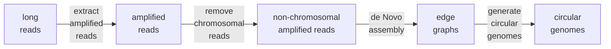

# ecLego2 - circular genomes asssembly from long-read data

ecLego2 performs circular genomes de Novo asssembly from long-read data using [Flye](https://github.com/fenderglass/Flye/) (https://github.com/fenderglass/Flye/).



## Motivation

The predecessor ecLego (2018-2022) uses a reference mapping approach to address the circular genomes structure with success. However, the quality of the reference is pivotal and such anchors make complete structure interpretation difficult in certain scenarios.

As with personalized genomes, each ecDNA (circular genome) population is unique and should serve as the backbone for its analyses. Works on ecLego2 started in 2021 to generate the populations of circular genomes captured in the long-reads.

## Using ecLego2

**ecLego2 setup**

* setup ecLego2 by cloning this repository under your project folder, e.g. ecLego under /<project_folder>/
```bash
# set up your project directory in the environment variable PROJECTDIR
export PROJECTDIR=/<project_folder>
cd ${PROJECTDIR}

# clone the repository
git clone https://github.com/cheehongsg/ecLego.git

# ensure that bash scripts are executable
cd ${PROJECTDIR}/ecLego
chmod u+x ./*.sh

# download singularity images
./download_sif.sh

# download t2tv2 genome reference
./download_hsa_t2tv2.sh

# setup kmers databases
./setup_hsa_t2tv2_kmerdbs.sh
```

**Running ecLego2 on your long-read data**

* set up your sample's ONT fastq file under /<project_folder>/ecLego/data, e.g. for sample B168 fastq, place it at: /<project_folder>/ecLego/data/B168/B168.fastq.gz

**ecDNA assembly resources consumption**
- 12 cores
- 36 GB memory (for error rate <3%, or higher memory for higher error rate)
- 3-12 hours runtime


**ecDNA assembly on a machine**

run as a process on the computer:
```bash
# assume singularity on path, and 
# ensure path is available in singularity run
export SINGULARITY_BINDPATH=/<project_folder>/ecLego
cd /<project_folder>/ecLego
pipeline/ecLegov2_s01.sh \
data/B168/B168.fastq.gz \
pipeline/genomes/t2tv2.fasta \
2>&1 | tee data/B168/B168.fastq.gz.ecLegov2.log
```

**or ecDNA assembly on a compute node**

submit as cluster job:
```bash
# assume singularity on path, and 
# ensure path is available in singularity run
export SINGULARITY_BINDPATH=/<project_folder>/ecLego
cd /<project_folder>/ecLego
sbatch -n 1 -c 12 --mem=36G --time 12:00:00 \
--job-name B168 \
pipeline/ecLegov2_s01.sh \
data/B168/B168.fastq.gz \
pipeline/genomes/t2tv2.fasta
```

**ecDNA assembly results**

* The most critical files for result interpretation are in the assembly folder. (Best to have a copy of the whole assembly folder)
```
data/B168/B168.fastq.gz-output/B168.fastq.gz_candidate_assembly/
    B168.cn15.disjointcyclic.gv.overview.xls
    B168.cn15.disjointcyclic.gv.graphvizonline.html
    B168.cn15.disjointcyclic.bam
    B168.cn15.disjointcyclic.bam.bai
```

* The next important files are the all edges assembled. (This gives you idea on where the ecDNA segments originated.)
```
data/B168/B168.fastq.gz-output/
    B168.fastq.gz.candidates.graph_before_rr.tdf
    B168.fastq.gz.candidates.graph_before_rr.bam
    B168.fastq.gz.candidates.graph_before_rr.bam.bai
```

* Finally, the set of reads considered for ecDNAs assembly.
```
data/B168/B168.fastq.gz-output/
    B168.fastq.gz.candidates.tdf
    B168.fastq.gz.candidates.bam
    B168.fastq.gz.candidates.bam.bai
```


## Acknowledgements
* JGM GT team, esp. Chew Yee NGAN and Meihong LI
* Wei Lab; Aziz Taghbalout
* Our projects collaborator
* [Flye](https://github.com/fenderglass/Flye/) (https://github.com/fenderglass/Flye/).
